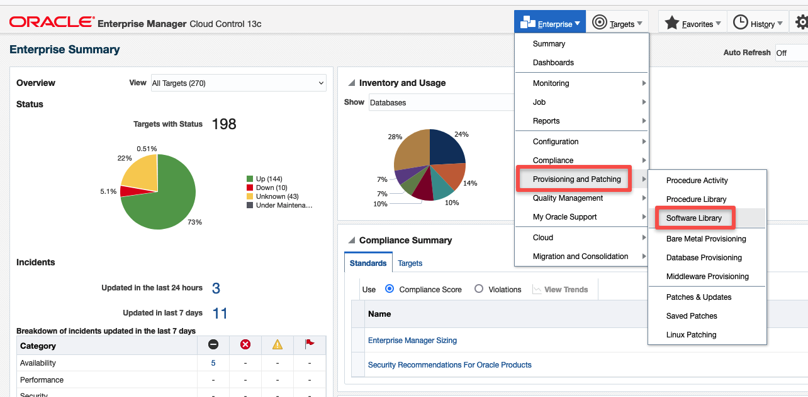
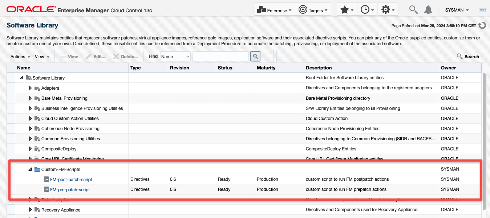
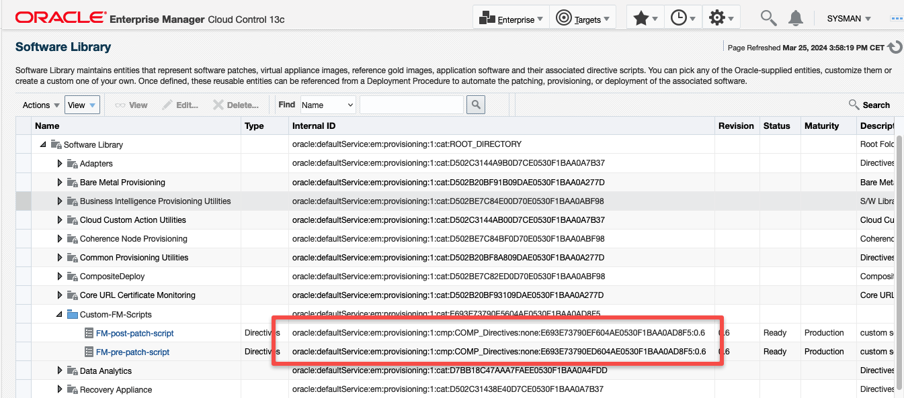

How to use Pre and Post Scripts for Fleet Maintenance Operations

# Introduction
In order to support automated maintenance activities for different Fleet Maintenance (FM) operations, Oracle Enterprise Manager allows support for configuring custom Pre/Post action scripts for different operations. The pre/post scripts need to be uploaded as EM Software Library Entity(Directive) prior to their usage with FM operations. All details can be found [here](https://docs.oracle.com/en/enterprise-manager/cloud-control/enterprise-manager-cloud-control/13.5/emlcm/database-fleet-maintenance.html#GUID-6AF19CA9-E83A-4C76-BF50-16E5A072EF92) in the documentation, but we will summarize the needed steps below as well.

# Getting started with the provided script
The bash script [FM_pre-post-actions.sh](../script/FM_pre-post-actions.sh) can be seen as kind of reference implementation for Pre/Post action scripts for RAC DB environments. I did create it for RAC environments with several special customizations in place due to existing configs still needed by legacy applications and scripts. 

Here is an example describing a simple use case:

The `listener.ora` file actually used on RAC nodes is the one located at `$GI_HOME/network/admin/listener.ora`. Now, let's assume that there are DB related scripts (leftovers from the time where the DB was running on a standalone server) which still expect the `listener.ora` file at `$DB_HOME/network/admin/listener.ora`. The workaround used for that is to have a symbolic link `$DB_HOME/network/admin/listener.ora -> $GI_HOME/network/admin/listener.ora` in place.

Since `GI_HOME` and `DB_HOME` get updated independently by different FM operations, an `UPDATE_GI` post action could be to update the symbolic link in `$DB_HOME/network/admin/` because this will not be done by the normal `UPDATE_GI` procedures. There focus is to update the cluster software from an `OLD_GI_HOME` to a `NEW_GI_HOME` unrelated to the actual RAC DBs running on that cluster. The same of course would be needed for a possible `ROLLBACK_GI` operation.

The provided script contains several solutions for such special use cases which were critical to address when I created it a while ago. They should be seen just as samples or templates for creating your own needed solution.

To make development and maintenance of the script easier I decided to use just one single script for all needed pre and post actions since the procedures usually are very similar and are using almost the same code e.g. to stop or start services or perform other needed config changes.

To make the script behaving as pre action script, you can see right at the top of the script the line

```
PREPATCH=true
```

To make the script acting as post action script, create a copy of it and set the paramter `PREPATCH` to `false` like here:

```
PREPATCH=false
```
That's how to get the Pre and Post action script out of the provided one.

# Uploading the Pre and Post action scripts to the Software Library
 1. In the OEM Console, select the Software Library:

 
    
 2. Follow the [official documentation](https://docs.oracle.com/en/enterprise-manager/cloud-control/enterprise-manager-cloud-control/13.5/emlcm/custom-and-scripts-fleet-operations.html#GUID-6AF19CA9-E83A-4C76-BF50-16E5A072EF92) to create a new folder for example named `Custom-FM-Scripts` and create two items of type `Directives` in it by selecting each file and using a `Shell Type` of `Bash` for them:

 

 3. Use UI menu View / Columns / Manage Columns to add the column `Internal ID`. This will allow you to select and save the script URNs for later usage:

 

 4. Submit a fleet maintenance operation using `emcli` like here:

 ```
 $ cat fm_update_gi.txt
 NEW_ORACLE_HOME_LIST=/u01/app/gi/19.21.0.0
 workingDir=/u01/tmp
 dispatchLoc=/u01/tmp/rootactions
 SKIP_PREREQUISITE_CHECKS=true
 SKIP_CVU_CHECK=true
 PREREQS_ONLY=false
 CUSTOM_PRE_SCRIPTS_URN=oracle:defaultService:em:provisioning:1:cmp:COMP_Directives:none:E693E73790ED604AE0530F1BAA0AD8F5:0.6
 CUSTOM_POST_SCRIPTS_URN=oracle:defaultService:em:provisioning:1:cmp:COMP_Directives:none:E693E73790EF604AE0530F1BAA0AD8F5:0.6


 $ emcli db_software_maintenance -performOperation -name="Update GI" -purpose=UPDATE_GI \
 -target_type=cluster -target_list="jfrac-cluster" \
 -normal_credential="ORACLE_OS:SYSMAN" -privilege_credential="ROOT_OS:SYSMAN" \
 -input_file="data:fm_update_gi.txt"
 ``` 
 
 5. Use UI menu Enterprise / Provisioning and Patching / Procedure Activity to get details of the job log:   

 ```
 .....
 The output of the directive is:

 Running script on node jfrac-2.localdomain
 All files from this run can be found here: /u01/app/oracle/FM-pre-post-actions/UPDATE_GI_27720
 Performing UPDATE_GI post-patch actions
 Setting up environment
 OLD_GI_HOME = /u01/app/gi/19.15.0.0
 NEW_GI_HOME = /u01/app/gi/19.21.0.0

 Running: verify/fix TFA config to ensure that it is running from NEW GI HOME

 TFA config looks good!

 Done with: verify/fix TFA config to ensure that it is running from NEW GI HOME

 Running: verifying listener.ora fix

 ls -l /u02/app/oracle/product/19.15.0.0/dbhome_1/network/admin/listener.ora
 lrwxrwxrwx. 1 oracle oinstall 47 Mar 18 19:33 /u02/app/oracle/product/19.15.0.0/dbhome_1/network/admin/listener.ora -> /u01/app/gi/19.21.0.0/network/admin/listener.ora
 ls -lL /u02/app/oracle/product/19.15.0.0/dbhome_1/network/admin/listener.ora
 -rw-r--r--. 1 oracle oinstall 1947 Mar 18 19:36 /u02/app/oracle/product/19.15.0.0/dbhome_1/network/admin/listener.ora

 Done with: verifying listener.ora fix

 done with all actions on node jfrac-2.localdomain

 Running script on node jfrac-1.localdomain
 All files from this run can be found here: /u01/app/oracle/FM-pre-post-actions/UPDATE_GI_31733
 Performing UPDATE_GI post-patch actions
 Setting up environment
 OLD_GI_HOME = /u01/app/gi/19.15.0.0
 NEW_GI_HOME = /u01/app/gi/19.21.0.0

 Running: verify/fix TFA config to ensure that it is running from NEW GI HOME

 TFA config looks good!

 Done with: verify/fix TFA config to ensure that it is running from NEW GI HOME

 Running: verifying listener.ora fix

 ls -l /u02/app/oracle/product/19.15.0.0/dbhome_1/network/admin/listener.ora
 lrwxrwxrwx. 1 oracle oinstall 47 Mar 18 19:33 /u02/app/oracle/product/19.15.0.0/dbhome_1/network/admin/listener.ora -> /u01/app/gi/19.21.0.0/network/admin/listener.ora
 ls -lL /u02/app/oracle/product/19.15.0.0/dbhome_1/network/admin/listener.ora
 -rw-r--r--. 1 oracle oinstall 1902 Mar 18 19:47 /u02/app/oracle/product/19.15.0.0/dbhome_1/network/admin/listener.ora

 Done with: verifying listener.ora fix

 done with all actions on node jfrac-1.localdomain
 .....
 ```

 In the above example log from a post action run, two actions/procedures where called on each cluster node:
  * `verify/fix TFA config to ensure that it is running from NEW GI HOME`
  * `verifying listener.ora fix`
    
 I will drill down in document [How to add your own procedures to the script](./Adding-own-procedures-to-the-actionscript.md) in more detail into the script structure and how the various actions/procedures will be called.
 
